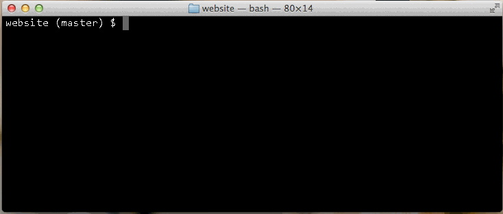
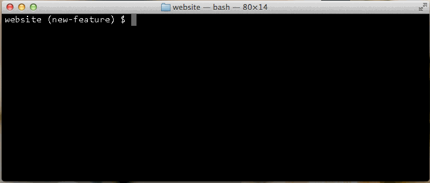


name: inverse
layout: true
class: center, middle, inverse

---

# GitHub Pages<br />(Plus More on Git)

.title-logo[]

---
layout: false

# Agenda

1. Hosting 101
2. Why use GitHub Pages
3. Let's deploy!
4. More on Git

---
template: inverse

# Hosting 101

---

# Getting Your Website on the Web

So far we have built and viewed our websites locally on own computers, but eventually you're probably going to want to share what you've built with a bigger audience.

To do that, you need to **host** your website on a web server.

---

# Hosting 101

We're going to dedicate an entire lesson to web hosting and domain names later in the course.

For now, just know that in order to get your website online you'll need the following two things...

---
class: center, middle

.large[
   A domain name

   .red[**AND**]

   Space on a web server to host your website files
]

---
class: center, middle


---
template: inverse

# Why Use GitHub Pages?

---

# Why Use GitHub Pages?

It's an easy way to get our projects online (for free!) right now, and a great way to practice our Git skills too.

GitHub Page takes care of hosting your website files and gives a domain name so people can find your website.

.inline-images[
   
]

---

# Types of GitHub Pages

It's important to note that there are two different kinds of sites you can deploy on GitHub Pages:

1. A user or organization site
2. A project site

---

# Some Limitations

GitHub pages have a few limitations:

- Static sites only (no database!)
- Form submissions are tricky
- Size limitations (1GB for a repo, 100MB max. per file)
- Bandwidth, up-time, support (you get what you pay for...)

---
template: inverse

# Using GitHub Pages

---

# Branching Review

Remember our earlier lesson where we talked about branching and merging?

We'll be using these skills extensively when we work with GitHub pages, so let's review...

---

# Branch/Merge Review

To create a new branch, check it out, and begin working on it, you simply run `git checkout -b <branch name> master`:



---

# Branch/Merge Review

Once you're done working on your branch, you'll need to **merge** your branch back into the master branch:



---

# Getting Started

To begin creating your project site, we'll start by creating and checking out a new branch in an existing repo that we have on GitHub.

This branch must be called `gh-pages`:

```bash
cd my-repo-folder
git checkout -b gh-pages master
```

---

# Getting Started

Let's push our files to the **gh-pages** branch on GitHub now:

```bash
git push origin gh-pages
```

And that's it! In 10 minutes or less, you'll be able to see your project live on the web at:

`http://<username>.github.io/<project_name>/`

After deploying, you'll want to **switch back** to your `master `branch (or other current working branch).

---

# Updating Your Site

Let's say we've deployed our site and we're back working on our master branch locally.

Once we're happy with our changes and we're ready to deploy to GitHub, we need to think about where we send our code.

---

# Updating Your Site

First, we want to make sure we update to our master branch (as a good habit, and to make sure that other collaborators can pull in our most recent commits).

---

# Updating Your Site

Next, we'll want to make sure we merge the current version of the master branch into our `gh-pages` branch too.

In doing so, we'll be **deploying** our new code live on the web.

---

# Updating Your Site

In plain English, we'd want to follow these steps:

1. Make and commit our changes on **master**
2. Push those changes to GitHub
3. Switch over to our **gh-pages** branch
4. Merge **master** into **gh-pages** to bring it up to date
5. Push the **gh-pages** branch to GitHub
6. Switch back to **master**

---

# Updating Your Site

A sample deployment workflow might look like this:

```bash
# make and commit our changes on master
git status
git add -A
git commit -m "Some descriptive commit message."

# update the master branch on GitHub
git push origin master

# switch to the gh-pages branch
git checkout gh-pages

# bring gh-pages up to date with master
git merge master

# commit the changes
git push origin gh-pages

# return to the master branch
git checkout master
```

---

# Rebase vs. Merge

Some people choose to use `git rebase master` instead of `git merge master` to bring their gh-pages branch up to date.

Rebasing is like merging, but it rewrites the history of the branch so that it appears all of the changes of the branch being merged in look like they happened on the destination branch.

---
class: center, middle

.large[
   Merging<br /><br />
]

.inline-images[
   
]

Image credit: [Atlassian Git Tutorial](https://www.atlassian.com/git/tutorials/using-branches)

---
class: center, middle

.large[
   Rebasing
]

.inline-images[
   
]

Image credit: [Atlassian Git Tutorial](https://www.atlassian.com/git/tutorials/rewriting-history/git-rebase)

---
class: center, middle

### A Word of Caution!

Rebasing can be dangerous if you don't know what you're doing, and you never want to rebase commits on a branch that has been pushed to public, shared repository.

---
template: inverse

# Merge Conflicts!!!

---

# Resolving Conflicts

If you attempt a merge and are told you have a conflict...

1. **Don't panic!**
2. Open the files that have conflicts
3. Edit the files and save your changes
4. Proceed with your merge in CLI or the GitHub GUI

**Tip:** You can back out of the merge (before completing it) by running `git merge --abort` from the command line.

---
template: inverse

# Undoing Commits

---
class: center, middle

### If I Could Turn Back Time...

Check out (and bookmark!) **[this resource](https://github.com/blog/2019-how-to-undo-almost-anything-with-git)** for undoing changes in various way in your Git repositories.

---

# What We've Learned

- How to create a `gh-pages` branch and keep it updated
- How to deal with merge conflicts
- How to revert commits in our repositories

---
template: inverse

# Questions?


