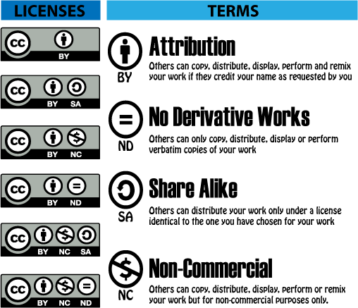


name: inverse
layout: true
class: center, middle, inverse

---

# Intro to Web Images

.title-logo[]

---
layout: false

# Agenda

1. Basic Photoshop Overview
2. Crop, Size and Save for Web
3. Common Web Formats
4. Image Best Practices
5. IMG tag considerations
6. Web tools for Image Editing
7. Copyright & Creative Commons

---

template: inverse

# Photoshop Overview
##Using Photoshop for the Web

---
##Basic Photoshop Image Functions

****Scaling****: Image &rarr; Image Size &rarr;  Input New Size

****Rotating****: Image &rarr; Image Rotation &rarr; Select Rotate Option

****Cropping****: Toolbar &rarr; Select Crop Tool &rarr; Drag Crop Box & Apply Crop 

****Saving for Web****:  Save for Web &rarr; Select Appropriate Format/Settings

---
template: inverse

# Common Web Formats
##JPG, PNG, GIF, SVG

---
## Common Web Formats

****JPG****: (Joint Photographers Group) Best for photos, gradients, graphics with tonal variations. Lossy image format.

****GIF****: (Graphics Interchange Format) This is a bitmap image format, but limited to 256 colours, no transparency. Often used now to save GIF animations. 1 level of transparency. Lossless format. Great for flat colour graphics like logos/icons/illustrations.

---
## Common Web Formats (cont.)

****PNG-8****: Raster image format, limited to 256 colours, no transparency. Preferred format over the GIF as file sizes are 10-30% smaller. 1 level of transparency. Lossless format.  Great for flat colour graphics like logos/icons/illustrations.

****PNG-24****: (Portable Network Graphics)Best for graphics and photos, supports multiple levels of transparency, and millions of colours.

****SVG****: (Scalable Vector Graphics) Vector graphics for the web that's rendered in XML. No quality loss when zoomed or scaled.
---
## Word of Caution: PNG-24

NOTE: PNG-24, which has 24 bits of colour (8bits per channel), allowing for up to 16 million colours, and provides greater transparency fading, gradients of colour, and better support for saving for photos. The draw back of this format is the larger file sizes, even larger than JPG, so consider the use of this format carefully, as it will affect download speed of the graphic. 

---
template: inverse

# Image Best Practices

---
## Image Best Practices
- Scale down images to the appropriate size for your webpage
- Choose the correct image format
- Optimize Images to a good quality and efficient file size
- Add alt tags to all images
- Save image names with relevant keywords (that will tie into SEO later)
- Keep a copy of the original editable .PSD file that you refer back to

---

template: inverse

# Image Tag Usage

---
# Image Tag Attributes

``

***alt tag:*** Provide alternate text to describe the image

***title tag:***  Provides further information about the image that is displayed in a tool tip

***class tag:***: Provides a link to the CSS stylesheet in order to style the image with properties like border and padding (from the Box Model)

---
template: inverse

# Web Imaging Tools
---
## Common Image Editing Software
- **Adobe Photoshop** - Industry standard image editing software
- **Adobe Illustrator** - Industry standard graphics editing software
- **Gimp** - Free **G**NU **I**mage **M**anipulating **P**rogram
- **Pixelmator** - Available for Mac and iOS

---
template: inverse
# Copyright & Creative Commons

---

## Creative Commons
- is a non-profit organization devoted to expanding the range of creative works available for others to build upon legally and to share.
- different types of licenses, as shown in various visual symbols, will show what rights are reserved and waived by the creator so that their work can be used by others
- allows for free usage of normally copyrighted work
- provides the author/creator flexibility in how their work is shared

---
## Different CC License Types

.inline-images[]

---

## Copyright Considerations 
- Copyright laws are designed to protect a creator's right to be compensated/attributed and to control how their work is used/shared. 
- All tangible creative works are protected by copyright immediately upon creation. 
- When in doubt, assume what you want to use is copyrighted material and seek permission to use it or find a suitable royalty free alternative.

---

## Copyright Tech DO's and Don'ts
- The internet is not public domain, things you "google" cannot just be downloaded to be used, examples include graphics, logos, fonts, photographs, and illustrations.

.inline-images[]
---

## Copyright Tech DO's and Don'ts
- Posting links that contain only a URL and the title of the site is generally acceptable.
- Don't copy a site's HTML or CSS (or any scripting code)
- Always get permission to use a copyrighted online work from the owner of that work
- Don't link to sites that contain large amounts of video or audio 

---

template: inverse

# Fin!


