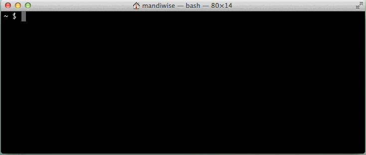


name: inverse
layout: true
class: center, middle, inverse

---

# Intro to the Command Line, Git & GitHub

.title-logo[]

---
layout: false

# Agenda

1. Get familiar with the command line (CLI)
2. What is Git and version control?
3. Git vs. GitHub
4. Using Git with the CLI or GUI

---
template: inverse

# What is the Command Line for?

---

class: center, middle

> "The command line is the ultimate seat of power on your computer...Unfortunately, the price of this power is complexity: nobody ever said that ruling your computer would be easy."

&mdash;David Baumgold

---
class: center, middle

### With great power also comes great responsibility...

---
class: center, middle

### But where do I find the "command line"?

---

# Command Line Apps

- On a Mac you can use the built-in Terminal app or download [iTerm2](https://www.iterm2.com/)
- On Windows, you'll want to have a console emulator like [cmder](http://gooseberrycreative.com/cmder) installed

---
template: inverse

# Let's Try Out Some Basic Commands

---
# Navigate the File System

`pwd` to figure out where you are:

.center[]

---

# Navigate the File System

`ls` to the list files in the current directory:

.center[]

---

# Change Directories

`cd <path>` to get to a sub-folder, and `cd ..` back:

.center[]

You can also `cd ../..` to go up two levels (and so on).

---

# Change Directories

Pro tip! You can `cd <drag/drop>` to populate the a path and `cd ~` to get all the way back to your home directory:

.center[]

---

# Work with Files

`touch <file>` to add a file and `rm <file>` to remove it:

.center[]

---

# Work with Files

You can also copy and move files within the file system:

- `cp <file> <location>` to copy a file
- `mv <file> <location>` to move a file

---

# Work with Folders

`mkdir <folder>` to create a new directory:

.center[]

Then `rm -r <folder>` to delete it and all of its files.

---

# Work with Folders

Note the structure of the command we use to delete a folder and all of its files: `rm -r <folder>`

The `-r` is known as a **flag** or **option** for the command.

In this case, the `-r` roughly translates to "recursively delete all of the folder's files too."

---

# Work with Folders

If a directory is empty, you can also use `rmdir <folder>` to remove it.

This will only work if the directory does not contain any files (including hidden files).

---
class: center, middle

### Danger Will Robinson!

Never run `rm -rf /` or `rm -rf *` unless you want to delete everything on your computer!

---

# Exercise 1

Time to roll up your sleeves and try out some commands!

Check out the steps for this exercise on the [learning materials page](/lesson/intro-to-version-control/) for this lesson.

---
template: inverse

# Now Let's Demystify Version Control

---
class: center, middle

### What is Version Control?

Version control is a system that records changes to a file or set of files over time so that you can recall specific versions later.

---

# What is Git?

- Traditional version control system are "centralized" where a single central copy of a project lives on server, and developers **commit** their changes to it
- But there are some downsides to this approach...

---

# What is Git?

- Git is a **distributed version control system (DVCS)**
- Developers **clone** copies of the **repository** locally with all of its previous history intact
- There can still be an "authoritative" repository that team members push to and pull from

---

# Git vs. GitHub

- Git is the version control system
- GitHub is a web-based app where you can create and account and then store and share your Git repositories
- This website is an example of a private GitHub repository

.inline-images[
   
   
]

---

# Exercise 2

Let's install Git together:

- You can check if you have Git installed already by running `git --version` on the command line
- If you don't have Git, we'll use the [GitHub method](https://help.github.com/articles/set-up-git/) to get you up and running right now
- You can install the [GitHub for Mac](https://mac.github.com/) or [GitHub for Windows](https://windows.github.com/) app as well and log in with your GitHub credentials

---
template: inverse

# Get Gittin'!

---
class: center, middle

### To GUI or not to GUI?

We can use the command line to run Git commands or a GUI-based app. Let's start by exploring the basics of the command line approach, then try a GUI.

---

# First Steps with Git

Creating a new Git repository for a project only requires running `git init` in the root folder of your project:

---

# First Steps with Git

If view the hidden files in the the directory where you just ran `git init`, you would now see an `.git` sub-directory there.

---

# First Steps with Git

Alternatively, you can `git clone <repo address>` to copy an existing Git repository to your computer:

---

# Committing Changes

As we make changes to our working directory where we initialized Git, we can check on the current state of our project by running `git status`:

---

# Committing Changes

Next, we need to tell Git that we want to keep track of the files that are currently untracked. To do that, run `git add -A` to add them to the **staging area**:

---

# Committing Changes

Now it's actually time to commit our changes to the repository. To do that, run `git commit -m "And and your commit message here."`

Committing changes in Git is like a saving a snapshot of your project in your local copy.

---

# Commit Pro Tips

- Commits should be atomic so you can revert changes with minimal impact to the rest of the project
- Keep your commit messages short and descriptive
- Most developers start their commit messages with present tense verbs

---
template: inverse

# But Wait, There's More!

---

# Working with Remotes

When you work with a team you'll likely want to designate one copy of the repository as the "authoritative" place where everyone can **push** their own local changes and **pull** in other collaborators' changes.

A service such as GitHub or Bitbucket is a handy place for storing these repositories.

---

# Working with Remotes

You can add a remote to a local repository by running `git remote add <name> <url>`.

And you can see the URLs of any existing remote repositories in your local repo by running `git remote -v`.

---

# Branching and Merging

**Branches** are a cool feature of Git that allow you to make a copy of your code to make separate commits to.

Branches are helpful when you're working on a new feature for your project and you want to keep it separate from your main code base until it's fully built-out.

---

# Branching and Merging

To create a new branch, check it out, and begin working on it, you simply run `git checkout -b <branch name> master`:

---

# Branching and Merging

Once you're done working on your branch, you'll need to **merge** your branch back into the master branch:

---

# Branching and Merging

A typical branching workflow may work like this:

```bash
# Start a new feature
git checkout -b new-feature master

# Edit some files
git add <file>
git commit -m "Start a feature"

# Edit some files
git add <file>
git commit -m "Finish a feature"

# Merge in the new-feature branch
git checkout master
git merge new-feature
git branch -d new-feature
```

---

# Using a GUI for Git

So far, we've been using Git the hard way&mdash;using the CLI only.

But we previously installed GitHub for Mac or GitHub for Windows, and these apps can be useful in helping you visualize what's happening with your project's Git workflow.

---

# Using a GUI for Git

You can easily add a local repository to your online GitHub account using one of its apps:

.inline-images[
   
]

---

# Exercise 3

Let's put some real code up on GitHub using the skills we just learned.

You're going to turn your Week 1 Project into a Git repo, and push it to GitHub.

You can use a GUI-based app to accomplish this, or if you're brave, try doing it entirely from the command line.

---
template: inverse

# Fin!


