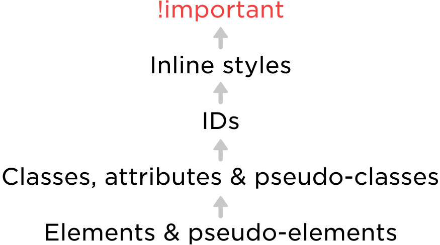


name: inverse
layout: true
class: center, middle, inverse

---

# CSS Best Practices

.title-logo[]

---
layout: false

# Agenda

1. Specificity: taming the specificity beast
2. CSS that's maintainable and scalable
3. OOCSS FTW

---
template: inverse

# Specificity

---
class: center, middle

### What We Mean by "Specificity"

Specificity determines which CSS rules are applied to an element by the browser.

---

class: center, middle

.large[
   What makes a rule more specific?
]

---
class: center, middle



---
class: center, middle

.large[
   So how does it work?
]

---
class: center, middle

.large[
   Keep these 2 things in mind...
]

---

# How Specificity Works

**Where specificity is equal, the rules that comes last applies.**

```html
<header class="masthead">
   <h1>My Awesome Site</h1>
</header>
```

```css
header h1 {
   color: black;
}

header h1 {
   color: red;
}
```

The color of the `h1` text will be red in this case.

---

# How Specificity Works

**Where specificity is not equal, the more specific rule applies.**

```html
<header class="masthead">
   <h1>My Awesome Site</h1>
</header>
```

```css
.masthead h1 {
   color: black;
}

header h1 {
   color: red;
}
```

The color of the `h1` text will be black in this case.

---
class: center, middle

.large[
   Gotcha alert!
]

---

# Specificity Run Amok

It doesn't take much for CSS specificity to spiral out of control:

```html
<nav id="social-nav">
   <ul class="social-links">
      <li><a href="#" class="social">Facebook</a></li>
   </ul>
</nav>
```

```css
nav#social-nav ul.social-links li a.social:hover {
   color: white;
}
```

**Yikes!**

---

# Specificity Run Amok

There's a good chance that CSS would be just as effective written as follows:

```css
.social:hover {
   color: white;
}
```

---

# Taming the Beast

Here are a few strategies to help avoid painting yourself into a corner with CSS specificity:

- Almost never use `!important`
- Don't use IDs as CSS selectors
- Avoid nesting selectors unnecessarily
- Don't over-qualify selectors
- Use classes, and create re-usable classes wherever possible

---

# Exercise 1

Let's experiment with CSS rule specificity:

<iframe height='268' scrolling='no' src='//codepen.io/redacademy/embed/XbpXdG/?height=268&theme-id=0&default-tab=css' frameborder='no' allowtransparency='true' allowfullscreen='true' style='width: 100%;'>See the Pen <a href='http://codepen.io/redacademy/pen/XbpXdG/'>XbpXdG</a> by RED Academy (<a href='http://codepen.io/redacademy'>@redacademy</a>) on <a href='http://codepen.io'>CodePen</a>.
</iframe>

---
template: inverse

# Scalability & Maintainability

---
class: center, middle

### Your CSS Should Scale Easily

We may have good intentions when we start writing our CSS, but as a project grows over time we need to make sure we're writing CSS that's **maintainable** and that **scales**.

---

# CSS Pro Tips

1. Keep your code organized
2. Use semantic selector names
3. Document your code with comments
4. Make it modular

---

# Get Organized

Well-organized code will save you headaches in the long run. Here are some organization tips:

- Order things logically (it matters for specificity, but also for readability)
- Put your properties in some kind of logical order
- Use whitespace, line breaks, and indentation
- Use shorthand wherever possible
- Be consistent!

---

# Keep It Semantic

The class and ID names you choose for your HTML elements should relate to the content itself, and not the styles applied to it. For example, this:

```html
<p class="alert">Error! Please try again.</p>
```

Is much more semantic and future-proof than this:

```html
<p class="red">Error! Please try again.</p>
```

---

# Document It

Adding comments to your code is an effective way to explain what your code does, both to other developers and to your future self. For example, this:

```css
/* Main navigation */
.dropdown-nav { }

/* Footer navigation */
.inline-nav { }
```

Is more helpful than this:

```css
.dropdown-nav { }
.inline-nav { }
```

---

# Modularity

Modular code is reusable code. For example, abstracting re-used styles into a class like this:

```css
.brand-color {
   color: red;
}
```

Is better than this:

```css
article h3 {
   color: red;
}

aside h3 {
   color: red;
}
```

---
template: inverse

# OOCSS

---
class: center, middle

### What is OOCSS?

Object oriented CSS (OOCSS) is a methodology of writing reusable CSS that is fast, scalable, and maintainable.

---

# What Makes CSS OOCSS?

Nicole Sullivan came up with the framework for OOCSS.

According to her, there are two basic principles of OOCSS:

1. Separation of **structure** from **skin**
2. Separation of **containers** from **content**

---

# Structure vs. Skin

Separating structure from skin includes abstracting the layout of an element away from the theme of a website. So this:

```css
.widget {
   width: 30%;
   background: yellow;
}
```

Becomes this:

```css
.grid-col-4 {
   width: 30%;
}

.widget {
   background: yellow;
}
```

---

# Container vs. Content

Separating content from the container involves removing the dependency of a parent element nesting children elements. So this:

```css
.sidebar h2 {
   border-bottom: 1px solid #000;
}
```

Becomes this:

```css
.widget-heading {
   border-bottom: 1px solid #000;
}
```

---
class: center, middle

### Word of Caution!

Strictly adhering to OOCSS isn't always practical in reality. Take these as basic guidelines, rather than rules to live by.

---

# Exercise 2

Let's clean up some code with the best practices we just learned:

<iframe height='268' scrolling='no' src='//codepen.io/redacademy/embed/BNpjxY/?height=268&theme-id=0&default-tab=css' frameborder='no' allowtransparency='true' allowfullscreen='true' style='width: 100%;'>See the Pen <a href='http://codepen.io/redacademy/pen/BNpjxY/'>BNpjxY</a> by RED Academy (<a href='http://codepen.io/redacademy'>@redacademy</a>) on <a href='http://codepen.io'>CodePen</a>.
</iframe>

---
template: inverse

# Fin!


