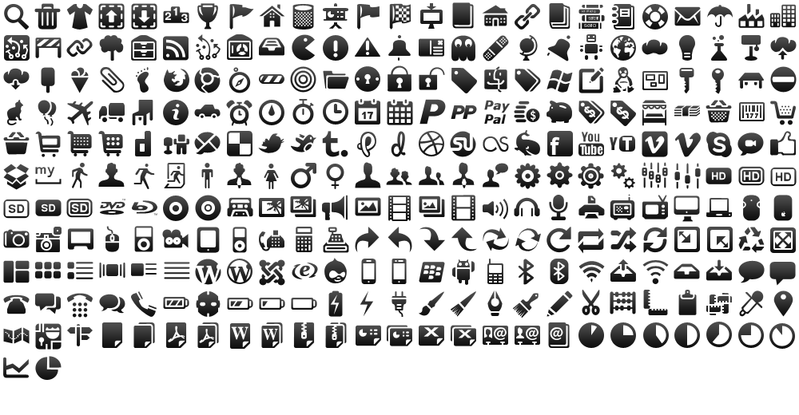
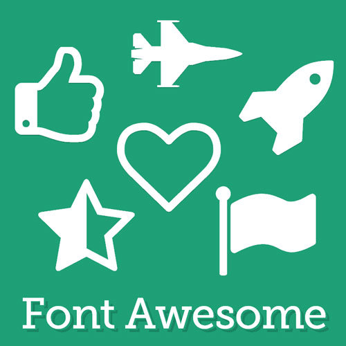


name: inverse
layout: true
class: center, middle, inverse

---

# Using Icon Fonts

.title-logo[]

---
layout: false

# Agenda

1. What's an icon font?
2. Using Font Awesome on your website

---
template: inverse

# What's an Icon Font?

---
class: center, middle

### Icon fonts are just fonts.

But instead of containing letters and numbers, they contain symbols (aka **glyphs**).

---

# Why Are They Awesome?

- You can target CSS at them, just like a normal font
- They're SVGs, so they scale without pixelating (so they're very responsive)
- They're supported even as far back as IE6!
- All of the icons supported by the font load with one HTTP request

---
class: center, middle

.large[
   The old way...
]

---
class: center, middle

.inline-images[
   
]

---
template: inverse

# Using an Icon Font

---

# Pick a Font

There are a few ready-made icon fonts out there that you can use on your website for free:

- [Font Awesome](http://fortawesome.github.io/Font-Awesome/)
- [IcoMoon](https://icomoon.io/)

We're going to take a look at Font Awesome...

---
class: center, middle

.inline-images[
   
]

---

# Using Font Awesome

To use Font Awesome, you can either externally link to it on Content Delivery Network (CDN), or you can download and include the entire package directly on your website.

You would include this code in the `<head>` tag of your website:

```html
<!-- Option 1: CDN -->
<link rel="stylesheet" href="//maxcdn.bootstrapcdn.com/font-awesome/4.3.0/css/font-awesome.min.css">

<!-- Option 2: Font Awesome -->
<link rel="stylesheet" href="path/to/font-awesome/css/font-awesome.min.css">
```

---

# Using Font Awesome

Now for the fun part&mdash;you actually get to start using the icons.

Let's say we want to include a [bicycle icon](http://fortawesome.github.io/Font-Awesome/icon/bicycle/) on our website.

All we would need to do is include an `<i>` tag with some special classes applied:

```html
<i class="fa fa-bicycle"></i>
```

And the result will look like this:

<i class="fa fa-bicycle"></i>

---

# Using Font Awesome

We can adjust the size of the icons with extra classes:

```html
<i class="fa fa-bicycle fa-lg"></i> fa-lg
<i class="fa fa-bicycle fa-2x"></i> fa-2x
<i class="fa fa-bicycle fa-3x"></i> fa-3x
<i class="fa fa-bicycle fa-4x"></i> fa-4x
```

<i class="fa fa-bicycle fa-lg"></i> fa-lg<br />
<i class="fa fa-bicycle fa-2x"></i> fa-2x<br />
<i class="fa fa-bicycle fa-3x"></i> fa-3x<br />
<i class="fa fa-bicycle fa-4x"></i> fa-4x

---

# Using Font Awesome

And animate the icons:

```html
<i class="fa fa-circle-o-notch fa-spin fa-3x"></i>
<i class="fa fa-spinner fa-pulse fa-3x"></i>
<i class="fa fa-bicycle fa-spin fa-3x"></i>
```

.inline-images[
   <br /><i class="fa fa-circle-o-notch fa-spin fa-3x"></i>&nbsp;&nbsp;&nbsp;
   <i class="fa fa-spinner fa-pulse fa-3x"></i>&nbsp;&nbsp;&nbsp;
   <i class="fa fa-bicycle fa-spin fa-3x"></i>
]
<br />

You can find all of Font Awesome's [icons referenced here](http://fortawesome.github.io/Font-Awesome/icons/) and [usage examples here](http://fortawesome.github.io/Font-Awesome/examples/).

---

# Using Font Awesome

Every Font Awesome icon also has a [Unicode value](http://fortawesome.github.io/Font-Awesome/cheatsheet/). Using those values, we can use Font Awesome directly in our CSS too:

```html
<button class="menu-toggle"><span>Menu</span></button>
```

```css
.menu-toggle {
   display: none;
}

.menu-toggle:after {
   content: "\f0c9";
}
```

---

# Exercise 1

Let's try out Font Awesome:

<iframe height='268' scrolling='no' src='//codepen.io/redacademy/embed/vONJxM/?height=268&theme-id=0&default-tab=css' frameborder='no' allowtransparency='true' allowfullscreen='true' style='width: 100%;'>See the Pen <a href='http://codepen.io/redacademy/pen/vONJxM/'>vONJxM</a> by RED Academy (<a href='http://codepen.io/redacademy'>@redacademy</a>) on <a href='http://codepen.io'>CodePen</a>.
</iframe>

---

# What We've Learned

- What an icon font is
- The advantages of using an icon font
- How to use Font Awesome

---
template: inverse

# Questions?


