
name: inverse
layout: true
class: center, middle, inverse

---
template: inverse

# Design Toolbox

.title-logo[]

---
layout: false

# Agenda

1. What is design?
2. Elements of design
3. Colour Theory
4. Principles of design

---
template: inverse

# What Is Design?

---
class: center, middle

.large[
   Design is not art.
]

---
class: center, middle

> "Design is concerned with how things work, how they are controlled, and the nature of interaction between people and technology."

&mdash;Donald A. Norman, *The Design of Everyday Things*

---
class: center, middle

.large[
   But how is design done?
]

---
template: inverse

# Elements of Design

---

# Elements of Design

1. Line
2. Shape
3. Form
4. Texture
5. Colour

---

# Line

- Line is the lifeline of our civilization
- When we organize lines we get alphabets
- The character of a line can be changed by varying its width

---

# Line

Other qualities of a line that affect its character:

- Classical (vertical and horizontal) lines are stable
- Flowing horizontal lines are peaceful
- Zigzags are exciting
- Spiral suggests infinity
- Swirling linear lines remind us of nature

---
class: center, middle

.inline-images-border[
   [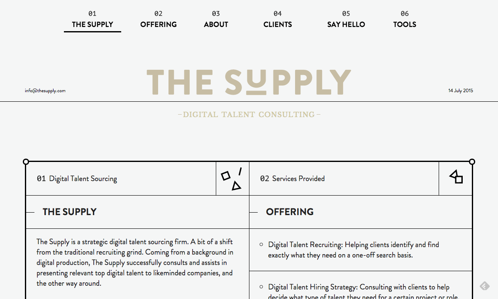](http://www.thesupply.com/)
]

---
class: center, middle

.inline-images-border[
   
]

---
class: center, middle

.inline-images-border[
   
]

---

# Shape

- When you close a line, you get a shape
- Shapes control and attract our attention

---

# Shape

Shapes also have character:

- **Biomorphic/Organic** shapes are inspired by nature

- **Geometric** shapes are precise

- **Decorative** shapes applied to the surface of another shape

---
class: center, middle

### Shape is related to space

.inline-images[
   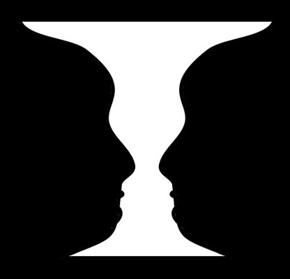  
]

*Negative and positive space are equally important.*

---
class: center, middle

.inline-images-border[
   [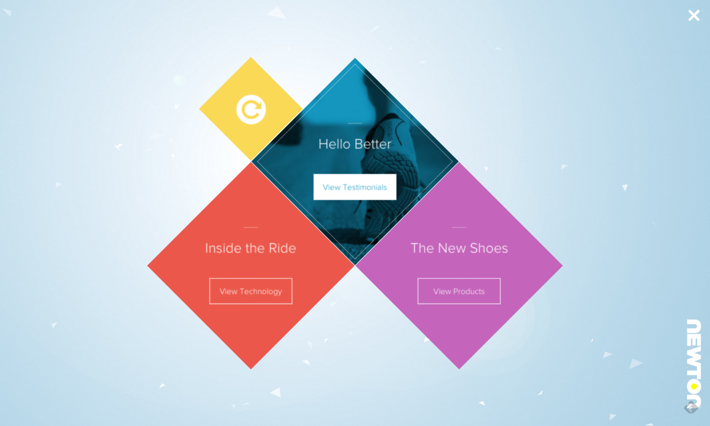](http://runbetter.newtonrunning.com/menu)
]

---
class: center, middle

.inline-images-border[
   [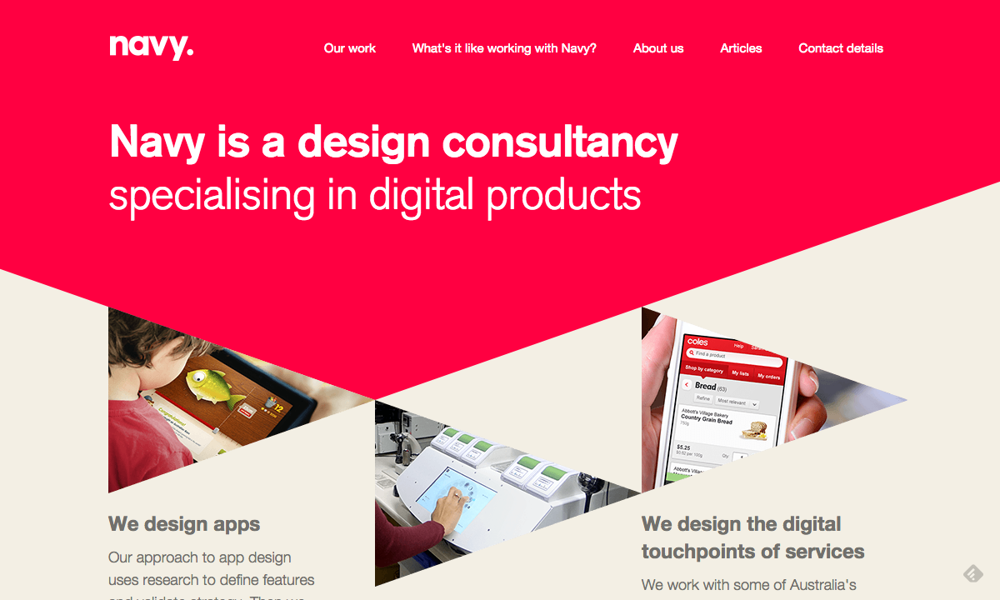](http://www.navydesign.com.au/)
]

---
class: center, middle

.inline-images-border[
   [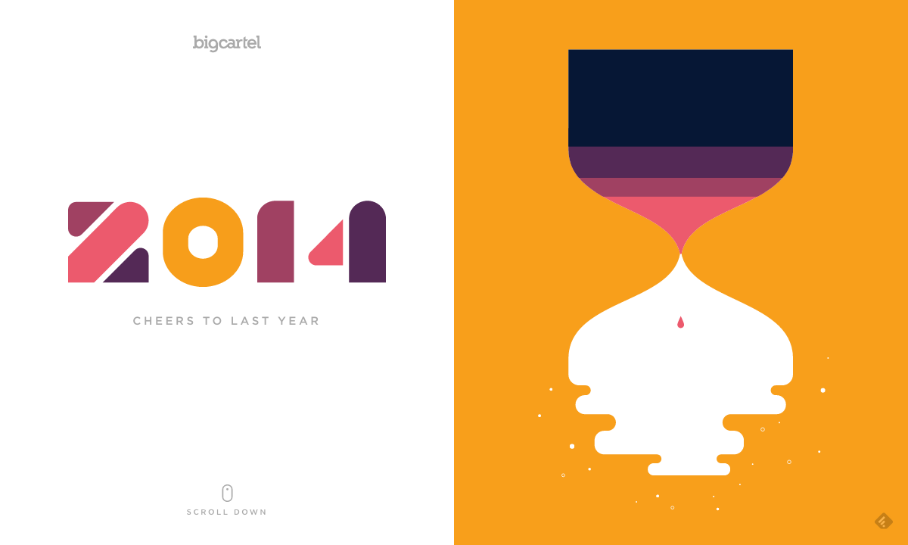](http://recap.bigcartel.com/2014/)
]

---

# Form

- Forms are three-dimensional objects
- They can be geometric or biomorphic/organic
- They have shadows on their surfaces and cast shadows
- Can be illustrated or constructed

---
class: center, middle

.inline-images-border[
   [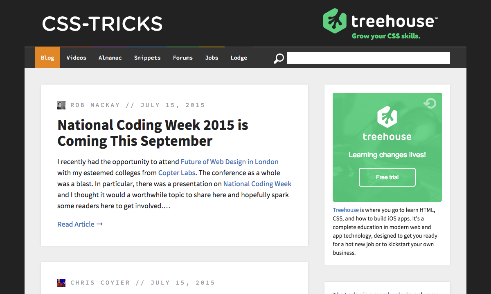](https://css-tricks.com/)
]

---
class: center, middle

.large[
   **[CSS Tetrahedron Experiment](http://paulrhayes.com/experiments/pyramid/)**
]

---

# Texture

- Real texture is the visual surface of an object (can be simulated or implied)
- Visual texture can also be simulated or implied
- **Skeuomorphism** is when web design takes cues from the physical world

---
class: center, middle

.inline-images-border[
   [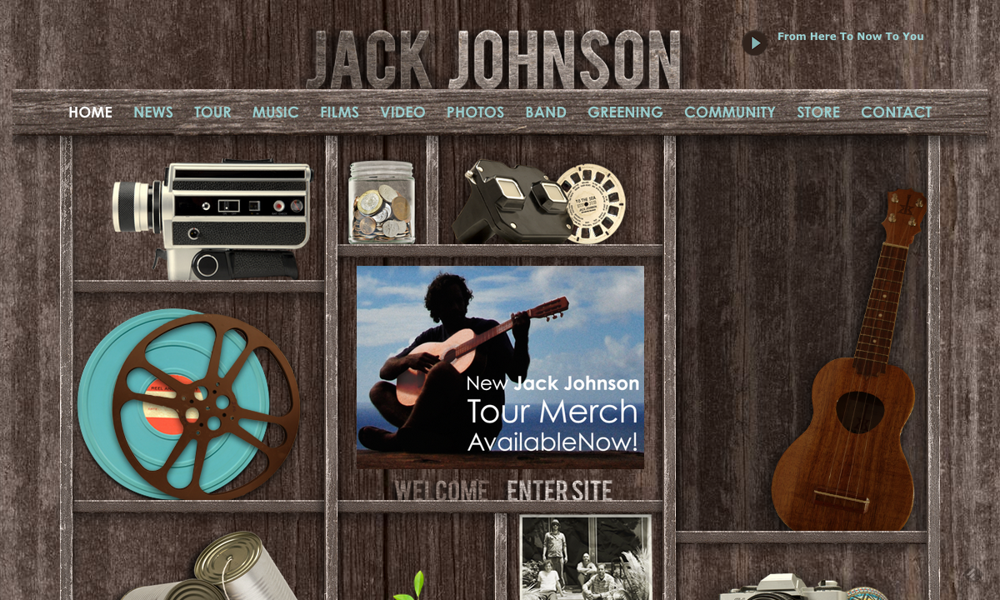](http://jackjohnsonmusic.com/)
]

---
class: center, middle

.inline-images-border[
   [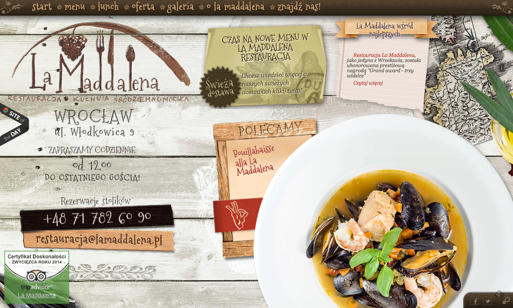](http://www.lamaddalena.pl/index-low.html)
]

---

# Texture

- When we organize the visual feel of an object, we end up with **pattern**
- Pattern has to do with repetition
- We can use colour or texture to create a pattern
- All patterns have texture, not all textures have patterns
- Simplest design of a pattern is a **motif**

---
class: center, middle

.inline-images-border[
   [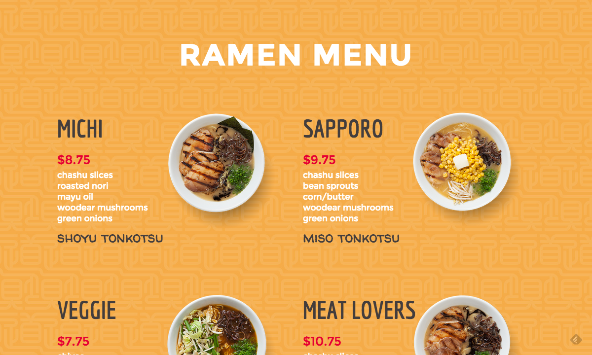](http://www.michiramen.com/)
]

---
class: center, middle

.large[
   That just leaves colour...
]

---
template: inverse

# Colour Theory

---

# Colour 101

Colour has three characteristics:

1. Hue
2. Value (aka Lightness or Brightness)
3. Saturation

---

# Hue

What we refer to as colour is technically referred to **hue**.

Hues can be **chromatic** or **achromatic**.

Hues can be **neutral** (white, black, or grey) or **near-neutral** (beige or off-white).

---
class: center, middle

.inline-images[
     
]

.footnote.right[
   *Source: [Designing for the Web](http://www.designingfortheweb.co.uk/part4/part4_chapter17.php)*
]

---
# Value

Value is the potential for a colour to be light or dark.

**High value** colours have white added to them.

**Low value** colours have black added to them.

---
class: center, middle

.inline-images[
     
]

.inline-images[
   
]

.footnote.right[
   *Source: [Designing for the Web](http://www.designingfortheweb.co.uk/part4/part4_chapter17.php)*
]

---

# Saturation

Saturation is the brightness or dullness of a hue.

Colours can be **high chroma** (full intensity).

Colours can be **low chroma** (made dull by adding a complement).

---

class: center, middle

.inline-images[
     
]

.footnote.right[
   *Source: [Designing for the Web](http://www.designingfortheweb.co.uk/part4/part4_chapter17.php)*
]

---
class: center, middle

.inline-images[
     
]

.footnote.right[
   *Source: [Designing for the Web](http://www.designingfortheweb.co.uk/part4/part4_chapter17.php)*
]

---
class: center, middle

.large[
   But how do we know which colours go best together?
]

---
class: center, middle

.inline-images[
   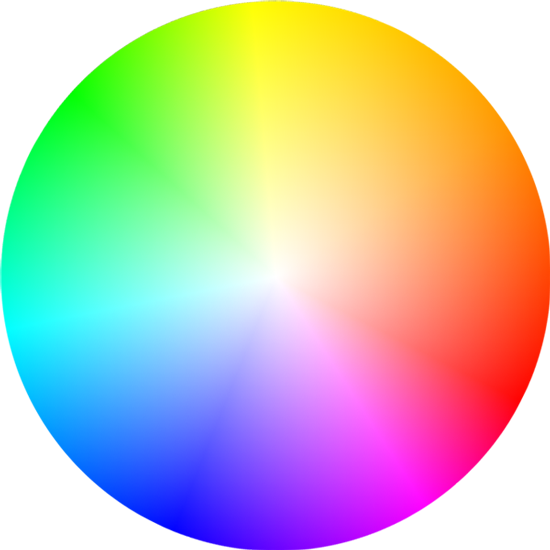
]

---

# The Colour Wheel

The Prang colour wheel is a mechanical arrangement that has 12 basic hues:

- Start with **primaries** (red, blue, yellow)
- Mix those to create **secondaries** (orange, purple, green)
- Then make **tertiaries** (belongs to primary family and a secondary family)

Using this wheel, we can create **colour harmonies**.

---
class: center, middle

.inline-images[
   
]

---
class: center, middle

.inline-images[
   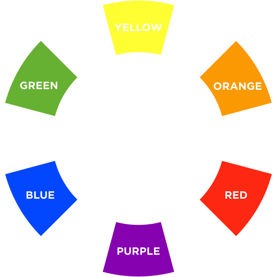
]

---
class: center, middle

.inline-images[
   
]

---
class: center, middle

### Monochromatic Harmony

.inline-images[
   
]

---
class: center, middle

.inline-images-border[
   [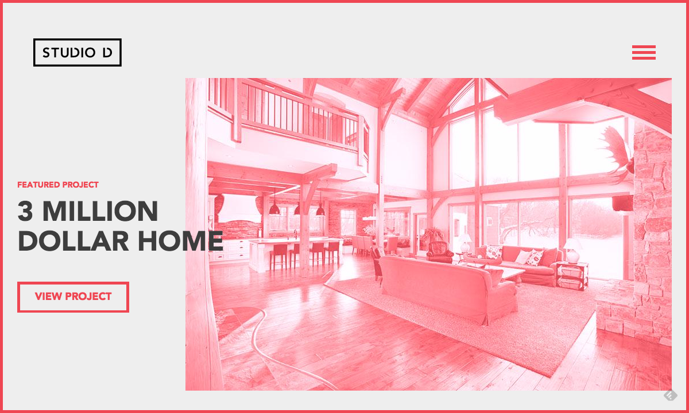](http://studiodyxe.com/)
]

---

class: center, middle

### Complementary Harmony

.inline-images[
     
]

---
class: center, middle

.inline-images-border[
   
]

---

class: center, middle

### Analogous Harmony

.inline-images[
   
]

---
class: center, middle

.inline-images-border[
   [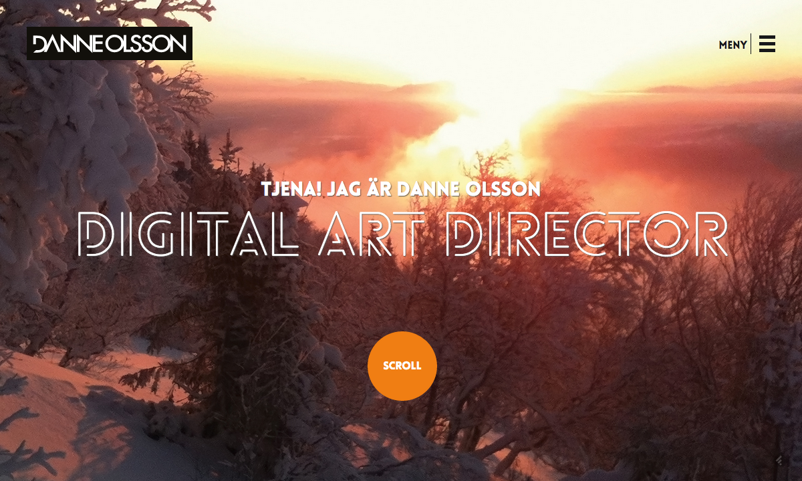](http://www.danneolsson.se/)
]

---
class: center, middle

.inline-images-border[
   
]

---
class: center, middle

### Split Complementary Harmony

.inline-images[
   
]

---
class: center, middle

.inline-images-border[
   
]

---

class: center, middle

### Triad Harmony

.inline-images[
   
]

---
class: center, middle

.inline-images-border[
   
]

---

class: center, middle

### Tetrad Harmony

.inline-images[
   
]

---
class: center, middle

.inline-images-border[
   
]

---

# Colour Quick Tips

- Colours "vibrate" when placed next to their colour partners
- Primary colours draw our attention
- Grey will pick-up whatever colour it's next to
- Colour has powerful emotional qualities and cultural connotations
- Colours have weight (yellow is the lightest, blue and purple are the heaviest)

---

# Exercise 1

Let's try creating colour palettes based on the colour harmony rules we just learned.

If you haven't done so already, create an **[Adobe Color CC](https://color.adobe.com/)** account and create at least five different colour palettes each based on a different colour harmony rule.

Don't limit yourself based on the built-in colour rules in the web app&mdash;be sure to try out some of the others you just learned too.

---
template: inverse

# Principles of Design

---
class: center, middle

.large[
   The **principles** of design are applied to the **elements** of design to bring our designs together.
]

---

# Principles of Design

1. Unity
2. Variety
3. Dominance
4. Balance
5. Scale/Proportion
6. Space

---

# Unity

- All elements working together to support the design as a cohesive whole
- Related to repetitions&mdash;which occur when repeating lines, shapes, colours, patterns, etc.
- Unity is related to Gestalt theory of perception
- "The whole is greater than the sum of its parts."

---
class: center, middle

.inline-images-border[
   [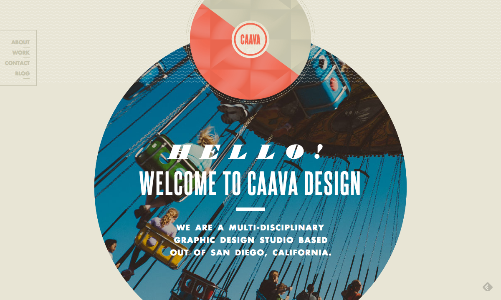](http://caavadesign.com/)
]

---

# Variety

- A dash or pause, in grammatical terms
- Variety makes design interesting
- Variety &ne; Chaos
- It's about creating variations on a theme
- Related to contrast&mdash;which is achieved using colour, tone/value, size/shape, and direction

---
class: center, middle

.inline-images-border[
   [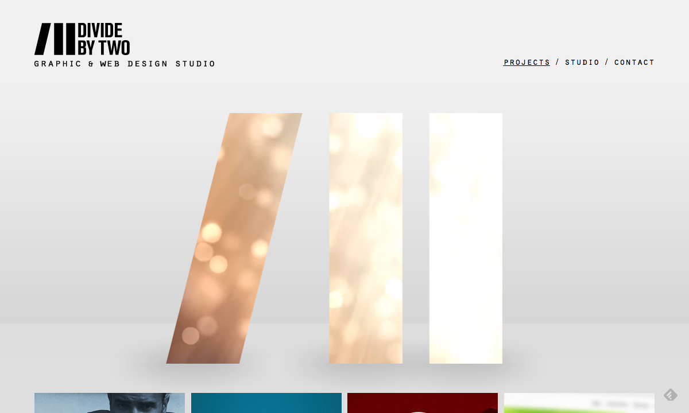](http://dividebytwo.pt/)
]

---

# Dominance

- What's different?
- What's bigger?
- What draws attention?
- More important elements usually receive special emphasis

---
class: center, middle

.inline-images-border[
   [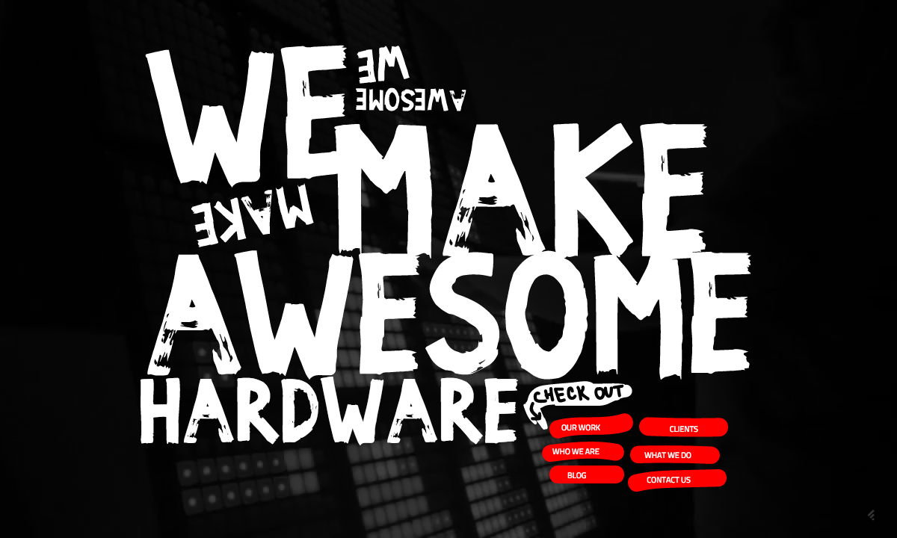](http://wemakeawesomesh.it/)
]

---

# Balance

- Formal balance (symmetrical)
- Informal balance (asymmetrical)
- Radial symmetry (like bike spokes)
- The Golden Ratio
- White space leaves breathing room

---
class: center, middle

.inline-images-border[
   
]

---

# Scale/Proportion

- Scale and proportion are related to size
- Scale is an outside measure ("this is to that")
- Proportion is an inside measure ("size of parts to whole")
- Visual hierarchy communicates priority

---
class: center, middle

.inline-images-border[
   [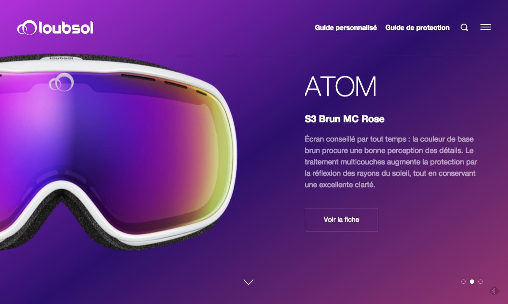](http://loubsol.com/)
]

---

# Space

- In two-dimensional design (like on the web), space creates the illusion of a third dimension
- As shapes move back in space they appear to get smaller
- Overlap creates the illusion of space
- Aerial perspective (the misty horizon effect)
- Hard lines help create contrast in space
- Space can be shallow or deep

---
class: center, middle

.inline-images-border[
   
]

---
class: center, middle

.large[
   Rules, rules, rules!
]

---
class: center, middle

.large[
   Knowing the rules lets you know when to break them.
]

---

# Exercise 2

Go to **[Unmatched Style](http://unmatchedstyle.com/)** and find an example of what you think is a well-designed website.

Jot down some notes about how it uses the elements and principles of design in terms of its layout and overall visual design.

After a few minutes evaluating your chosen website, team up with another class member and exchange your observations.

---

# What We've Learned

- The difference between design and art
- The elements and principles of design
- The difference between hue, value, saturation
- How to create colour harmonies

---
template: inverse

# Questions?


