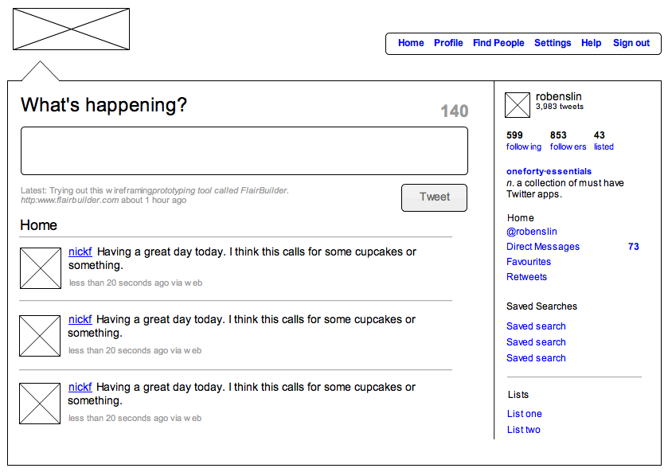
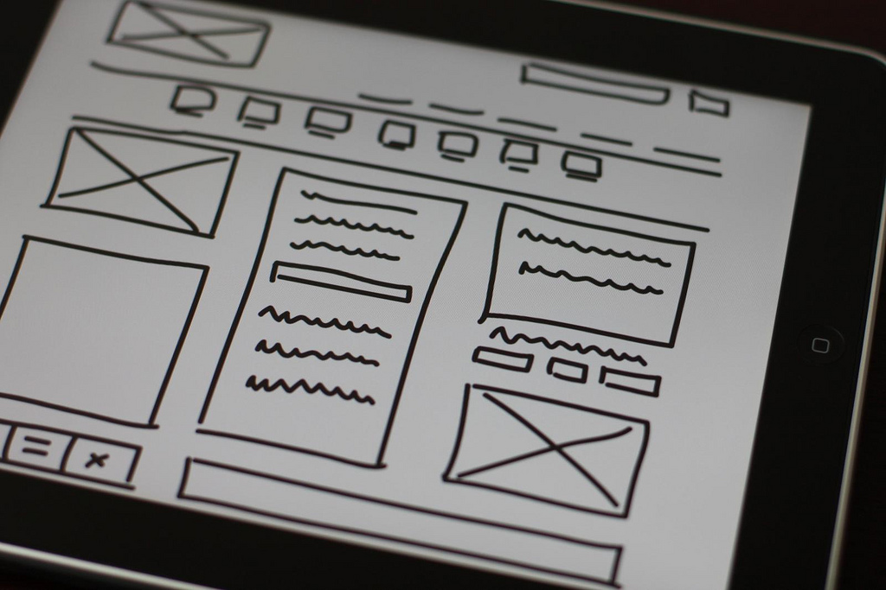
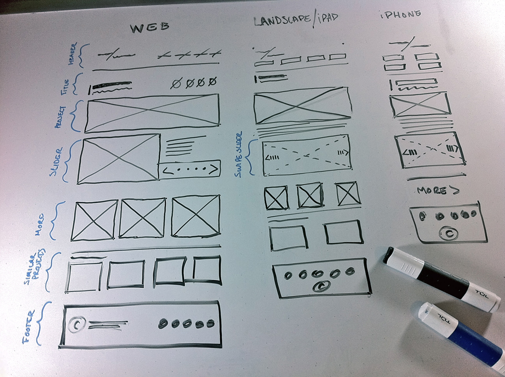


name: inverse
layout: true
class: center, middle, inverse

---
template: inverse

# Intro to Wireframing

.title-logo[]

---
layout: false

# Agenda

1. What's a wireframe?
2. Tools and techniques
4. Wireframing for different screen sizes

---
template: inverse

# What's a Wireframe?

---
class: center, middle

### A Definition

A wireframes is a simple representation of a website in simple visual blocks. It's like a blueprint showing where elements will be situated on the page, without any styling.

---
class: center, middle

.inline-images[
   
]

.footnote.right[
   Image Credit: [Rob Enslin](https://www.flickr.com/photos/doos/4689874175/)
]

---
class: center, middle

.inline-images[
   
]

.footnote.right[
   Image Credit: [Mike Rohde](https://www.flickr.com/photos/rohdesign/3307873748/)
]

---
class: center, middle

.inline-images[
   
]

.footnote.right[
   Image Credit: [baldiri](https://www.flickr.com/photos/baldiri/5734993652/)
]

---
class: center, middle

# Why do we wireframe?

---
class: center, middle

.large[
   Clarifies features early on.
]

---
class: center, middle

.large[
   Exposes navigation & usability issues up front.
]

---
class: center, middle

.large[
   Makes the design process more iterative.
]

---
class: center, middle

.large[
   Saves time.
]

---

# What to include?

Elements commonly found in wireframes include:

- Header (logo), headings, and sub-headings
- Navigation menus
- Search field
- Body content
- Share buttons
- Footer

---
class: center, middle

## What to leave out?

Wireframing is mostly about roughing-out the user interface and the prioritization of content, not the design.

---

# Exercise 1

Go to **[Unmatched Style](http://unmatchedstyle.com/)** again and pick a website to reductively transform into a wireframe.

Using some of the provided wireframe sketch paper, sketch what you think a wireframe should look like for the desktop width of that website.

If you have time, try sketching out wireframes for its mobile phone and tablet widths too.

Tip: Choose a website with some interesting layout features!

---
template: inverse

# Tools & Techniques

---

background-image: url(../../public/img/slide-assets/sketchbook-and-pen.jpg)

.footnote[
   Image Credit: [Startup Stock Photos](http://startupstockphotos.com/)
]

---

# Online Tools

These are just a few of the online wireframing tools available:

- [Balsamiq](http://www.balsamiq.com)
- [Mockingbird](http://www.gomockingbird.com)
- [wireframe.cc](https://wireframe.cc/)

---
class: center, middle

.large[
   ...or any tool that will let you draw lines and boxes!
]

---
template: inverse

# Wireframing Responsively

---
class: center, middle

.large[
   Wireframes are a great place to start working out how to responsively design a website.
]

---
class: center, middle

.inline-images[
   
]

.footnote.right[
   Image Credit: [Juan Arreguin](https://dribbble.com/shots/185755-Media-Queries)
]

---

# Exercise 2

Try out one of the recommended wireframing tools for this lesson, and quickly mock-up a wireframe based on the desktop sketch that you produced in the last exercise.

---
template: inverse

# Fin!


