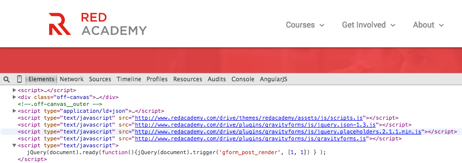
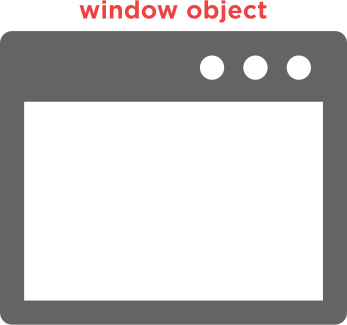
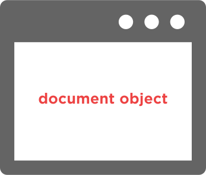


name: inverse
layout: true
class: center, middle, inverse

---

# Intro to JavaScript

.title-logo[]

---
layout: false

# Agenda

1. What is JavaScript? Why use it? How does it work?
2. Variables and comments
3. The window and document "objects"
4. Arithmetic and comparison operators
5. Conditionals and loops
6. Accessing elements on a page
7. Including scripts on a webpage

---
template: inverse

# What is JavaScript?

---
class: center, middle

### JavaScript is a programming language

Computers need you to tell them what to do.

---
class: center, middle

### JavaScript is not "Java"

The shared name is just a remnant from the 1990s.

---
template: inverse

# Why Should I Use JavaScript?

---
class: center, middle

> "There are two answers. The first is that you don't have a choice...The other answer is that, despite it's deficiencies, *JavaScript is really good*."

From "JavaScript: The Good Parts"

---
template: inverse

# But What Is It for Exactly?

---
class: center, middle

.large[
   **HTML** &rarr; the content layer

   **CSS** &rarr; the presentation layer

   **JS** &rarr; the behaviour layer
]

---

# Client-side / Server-side

- Client-side scripts run in the **browser**
- For the most part, JS is the only client-side script today
- Server-side scripts run on a **server**
- PHP, Ruby, and Python run on the server side
- But JS can run server-side as well today using Node.js...

---

# The Console

Because JS is "client-side" you can see it in your browser:

.border[
   
]

---

# The Console

You can write it right in your browser too using the **console**:

.inline-images-border[
   
]

You can also use the console to identify bugs in your JS code.

.inline-images-border[
   
]

---

# What Is Syntax?

- Syntax is the set of rules or "grammar" of a particular programming language
- It sets the rules that determine how your code should be structured so computers can understand it
- A text-based language's syntax will permit specific combinations of letter, numbers, and symbols
- Scratch was a "visual" programming language, not a text-based one like JS

---

# JavaScript Syntax

Say hello:

```javascript
var name = 'Bob';
alert('Hi ' + name + '!');
```

You can try running these lines of code in your browser console right now!

---

# JavaScript Syntax

Figure out if it's Tuesday:

```javascript
var today = new Date;
var dayOfWeek = today.getDay();
var greeting;

if ( dayOfWeek == 2 ) {
   greeting = 'Today is Tuesday';
} else {
   greeting = 'Nope, not Tuesday!';
}

document.write('<h2>' + greeting + '</h2>');
```

---
class: center, middle

.large[
   Remember, a variable is an arbitrary "bucket" for temporarily storing information in your computer's memory.
]

---

# Variables

In JS, we use the **var** keyword to define our variables.

We can define variables as strings (with HTML tags):

```javascript
var color = 'red';
var heading = '<h1>Page Heading</h1>';
var numberString = '10';

var question = 'What\'s your name?';
```

String must be wrapped in quotes, and quotes within a string must be "escaped" with a backslash.

---

# Variables

Variables can be integers or booleans:

```javascript
var height = 7;
var width = 5;

var aliveAndWell = true;
```

Integers and booleans do not need to be wrapped in quotes.

---

# Variables

And we can **concatenate** different pieces together:

```javascript
var salutation = 'Ms.';

var addressee = 'Dear ' + salutation +  ' Sunshine:';
```

The variable `addressee` will now return "Dear Ms. Sunshine:".

Notice the use of the `+` sign to join variable and strings.

---

# Variable Pro Tips

- Make sure your variable names are descriptive (i.e. not `var a = 'First'`)
- Use camelCase for defining JS variables
- You can only use the dollar sign and underscore special characters in variable names

---

# Comments

We can add **comments** to our code too:

```javascript
var foo = "Hello World";

// Add a single line comment with 2 forward slashes

/*
   Add a multi-line comment like this
*/

document.write(foo);
```

Comments are always hidden from execution in the script.

---
class: center, middle

.large[
   Two important JS concepts...
]

---

.left-column[
  ## The Window Object
]

.right-column[
   The "window object" is the browser's representation of each window or tab.

   .inline-images[
      
   ]
]

---

.left-column[
  ## The Document Object
]

.right-column[
   The document object is the model of the web page inside of the window/tab. It represents the HTML page:

   .inline-images[
      
   ]
]

---
class: center, middle

**We've already seen examples of how you can perform actions on the window and document objects:**

`alert('Hi ' + name + '!');`

`document.write('<h2>' + greeting + '</h2>');`

---

# Methods

Methods perform certain tasks for the objects:

- `alert()` and `document.write()` are examples of object "methods"
- The `alert()` method will open an alert box in front of the window
- The `document.write()` method will add content to page wherever the script is executed
- `prompt()` is another handy method

---
class: center, middle

### Try Them Out!

Open a new browser tab and open the console, and type in each line one at a time:

`alert('Hello World!')`

`prompt('What\'s your name?')`

`document.write('<h1>Hi There!</h1>')`

---
# Exercise 1

Now let's try out some of these methods on Codepen:

<iframe height='268' scrolling='no' src='//codepen.io/redacademy/embed/RProXV/?height=268&theme-id=0&default-tab=js' frameborder='no' allowtransparency='true' allowfullscreen='true' style='width: 100%;'>See the Pen <a href='http://codepen.io/redacademy/pen/RProXV/'>RProXV</a> by RED Academy (<a href='http://codepen.io/redacademy'>@redacademy</a>) on <a href='http://codepen.io'>CodePen</a>.
</iframe>

---
template: inverse

# Let's Get a Little Bit Fancy Now

---

# Arithmetic Operators

Operators allow us to create a single value from multiple values. We can use `+`, `-`, `/`, and `*` to calculate values and store them in variables:

```javascript
var quantity = 3 + 2;
var total = (4 - 1) * 3; // parentheses evaluated first
```

---

# Arithmetic Operators

There are also special operators that allow us to increment or decrement a value:

```javascript
var i = 5;
i++; // adds 1 to i
```

```javascript
var i = 5;
i--; // subtracts i from i
```

Or find the remainder of an expression:

```javascript
var 10 % 3; // returns 1
var 6 % 2; // returns 0
```

---

# Comparison Operators

We can also compare values and evaluate their result:

```javascript
3 > 2 // returns true
3 >= 2 // returns true
3 < 2 // returns false
3 == 2 // returns false
3 != 2 // returns true
```

Note that `!=` means "does not equal."

---

# Conditionals

Just like in Scratch, we can decide whether we want to run code depending on if a condition is met:

```javascript
var highScore = 150;
var score = 149;

if ( highScore < score ) {
   document.write('You beat your high score!');
} else if ( highScore == score ) {
   document.write('You matched your high score!');
} else {
   document.write('Please try again.');
}
```

In JS, we use "if," "else if," and "else" with curly braces for conditional statements.

---

# Loops

- Again, like in Scratch, we can create loops in JS
- Loops allow us to repeat a set of instructions over and over again as long as a condition is still `true`
- Once the condition is no longer true (i.e. it returns `false`), the loop will stop
- In JS, there are "for" loops, "while" loops, and "do while" loops

---

# Loop Syntax

Initialization:

```javascript
var i = 0;
```

Condition:

```javascript
i < 5;
```

Update:

```javascript
i++; // remember that ++ add 1 to an integer
i--; // and you can decrement too
```

---

# While Loops

While loops are helpful when you don't know how many times it needs to run:

```javascript
var i = 0;
var score = 0;

while (i < 5) {
  score = i;
  document.write("Your score : " + score + "<br />");
  i++;
}
```

What do you think the final score will be after this loop runs?

---

# Do While Loops

Do while loops are similar to while loops, but they always run at least once:

```javascript
var i = 2;
var score = 0;

do {
  score = i;
  document.write("Your score : " + score + "<br />");
  i++;
} while (i < 1);
```

What do you think the loop will return this time?

---
class: center, middle

## A Word of Caution!

It's very easy to accidentally create an "infinite loop" using while and do while loops!

---

# For Loops

For loops allow you to set a specific number of times that the loop will run:

```javascript
var count = 0;

for (var i = 1; i < 5; i++) {
  count = i;
  document.write('Current count: ' + count + '<br />');
}
```

You will likely find yourself using for loops most often with "arrays" (we'll get to those shortly...).

---

# Exercise 2

Let's try using loops and conditionals on Codepen:

<iframe height='268' scrolling='no' src='//codepen.io/redacademy/embed/EjPZja/?height=268&theme-id=0&default-tab=js' frameborder='no' allowtransparency='true' allowfullscreen='true' style='width: 100%;'>See the Pen <a href='http://codepen.io/redacademy/pen/EjPZja/'>EjPZja</a> by RED Academy (<a href='http://codepen.io/redacademy'>@redacademy</a>) on <a href='http://codepen.io'>CodePen</a>.
</iframe>

---

template: inverse

# Using JavaScript on a Website

---
class: center, middle

### Time for things to get real!

Sooner or later you're actually going to want to incorporate JS in a real website, so let's see how that's done...

---

# Directly in the HTML

You can wrap your JavaScript in `script` tags directly in the HTML document:

```html
<!DOCTYPE html>
<html>
   <head>
      <title>Spot's Dog Grooming</title>
   </head>
   <body>
      <h1>Spot's Dog Grooming</h1>
      <script>
         document.write('Welcome to Spot\'s!');
      </script>
   </body>
</html>
```

---

# As a Separate ".js" File

Usually, you'll want to link to a separate `.js` file:

```html
<!DOCTYPE html>
<html>
   <head>
      <title>Spot's Dog Grooming</title>
   </head>
   <body>
      <h1>Spot's Dog Grooming</h1>
      <script src="js/say-hello.js"></script>
   </body>
</html>
```

```javascript
// js/sayhello.js

document.write('Welcome to Spot\'s!');
```

---

# Include in the head tag or bottom of the page?

- You can include a `<script>` in the `<head>` tag or anywhere inside the `<body>`
- The best practice is to put scripts in the footer to prevent them from blocking the page load
- But some scripts must go in the `<head>`...

---
class: center, middle

### Accessing Elements

You're likely to find that `document.write()` has some serious limitations. So how we can get more specific about the elements we target on a real webpage?

---

# Accessing Elements

The document object has many methods in JS that can help you select and element in a webpage, such as:

- `getElementById()`
- `querySelector()`

---

# Accessing Elements

And these will help you select multiple elements:

- `getElementsByClassName()`
- `getElementsByTagName()`
- `querySelectorAll()`

---

# Accessing Elements

Let's say we want to update the message paragraph below:

```html
<body>
   <h1>Spot's Dog Grooming</h1>
   <p id="message">Welcome to Spots!</p>
   <script src="js/say-hello.js"></script>
</body>
```

We can use the `getElementById` method to target that `p`, and update it's content using the `innerHTML` property:

```javascript
// js/sayhello.js

document.getElementById('message').innerHTML = 'We love dogs!';
```

---

# Accessing Elements

We can also store the results of `getElementById` in a variable to make it faster and easier to re-use for other purposes later:

```javascript
// js/sayhello.js

var el = document.getElementById('message');
el.innerHTML = 'We love dogs!';
el.className = 'red'; // adds class name of "red" to the element
```

---

# Logging Values to the Console

You can also use `console.log()` to simply print out and test values in the browser's console from your code, instead of writing them to your document.

```javascript
var greeting = "Hi there!";
console.log(greeting);
```

---

# Exercise 3

Let's try targeting some HTML elements:

<iframe height='268' scrolling='no' src='//codepen.io/redacademy/embed/XbXxey/?height=268&theme-id=0&default-tab=js' frameborder='no' allowtransparency='true' allowfullscreen='true' style='width: 100%;'>See the Pen <a href='http://codepen.io/redacademy/pen/XbXxey/'>XbXxey</a> by RED Academy (<a href='http://codepen.io/redacademy'>@redacademy</a>) on <a href='http://codepen.io'>CodePen</a>.
</iframe>

---

# What We've Learned

1. What JavaScript is and what it's used for
2. How we can create variables, conditionals, and loops in JS
3. What the window and documents objects are
4. How to access HTML elements using JS
5. How to include JS files in a webpage

---
template: inverse

# Questions?


