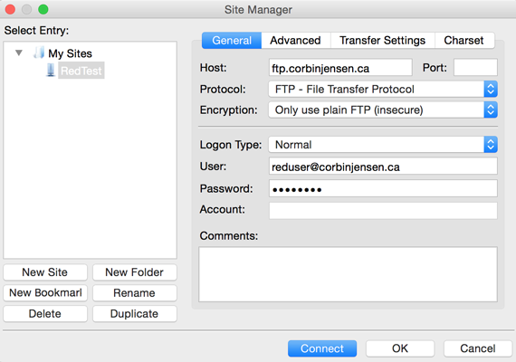


name: inverse
layout: true
class: center, middle, inverse

---

# Deploying a Website

.title-logo[]

---
layout: false

# Agenda

1. Cross-browser testing
2. Website performance
3. Purchasing a domain name
4. Selecting a web host
5. Using FTP

---
template: inverse

# Testing: Why Do It?

---
class: center, middle

### Why We Test

As the complexity of your code increases, it's easy for small changes and feature additions to have unexpected impacts.

---
class: center, middle

### Why We Test

...and to ensure that the users who need to access our website can do so in a browser and on a device of their choosing.

---

# What We Test

When we test a website, we want to make sure:

- Our code is **valid**
- Our website works across different browsers (and also looks as it should)
- Our website loads quickly and makes optimal use of bandwidth
- Our website and its content can be accessed by people who use assistive technologies to browse the web

---
class: center, middle

### An Ongoing Process, Not a Checklist

Front-end testing isn't something to simply worry about before you launch a website. It's an ongoing process!

---

# A Plan for Testing

A basic plan of attack for testing your front-end website code:

- Validate first
- Cross-browser test
- Test page performance
- Verify accessibility

---
template: inverse

# Cross-Browser Testing

---

# Cross-Browser Testing

Cross-browser testing means exactly that...

You're going to check to makes sure that your website **code**, its **design**, and **functional features** have been optimized for the array of browsers and devices that you need to support.

*And yes, this can be a very tedious task...*

You also have to make decisions about whether you will provide **full** or **partial** support.

---
class: center, middle

---

# Know Your Audience

To know what browsers and devices you need to support, you need to **know who your target audience is**.

Analytics can provide **some insight** into this, but should be treated with caution.

Conducting **real user research** is best!

---

# Brass Tacks

The array of browsers and devices you provide support for and test on will also be determined by:

- **Your project's budget**
- **Available timeline**
- **Planned scope of support**

---

# Make Informed Choices

Making **smart choices** about the way you write your code up-front can save you a massive headache when it comes time to *cross-browser test*:

- **Progressive enhancement** vs. graceful degradation
- Save yourself the guess work and **research HTML elements and CSS properties** and selectors on [Can I use...](http://caniuse.com/) beforehand

---

# Browser Testing Tools

There are **many (mostly paid) tools** that can assist with cross-browser testing:

- [BrowserStack](https://www.browserstack.com/)
- [Browserling](https://www.browserling.com/)
- [BrowserShots](http://browsershots.org/)

These tools can be a little slow and/or janky...you've been warned!

---
class: center, middle

### Nothing Beats the Real Thing

Wherever you can, test using **real browsers and devices**. But of course, there's this problem again...

---
background-image: url(../../public/img/slide-assets/rwd-device-proliferation.jpg)

.footnote.white[
   Image Credit: [Luke Wroblewski](https://www.flickr.com/photos/lukew/10430507184/)
]

---

# Testing Tips for IE & Mobile Devices

To test on multiple version of IE, checkout the Windows "Virtual Machines" available at [modern.ie](http://dev.modern.ie/tools/vms/).

You can also use a device rental service such as [Wavefront](http://www.wavefrontac.com/national-device-library-rental/) to test on a broad variety of mobile devices.

---
template: inverse

# Page Performance

---
class: center, middle

### Why Performance Matters

Your website doesn't have a lot of time to make a first impression on user.

Your users also likely won't be very happy if loading your homepage on their phone consumes 100MB of their data plan!

---
class: center, middle

### Performance is (mostly) on you!

Load time is typically 20% dependent on back-end activities (...so the DNS look-up, connecting to the server, SSL negotiation, and then content retrieval).

The other 80% is dependent on what happens in the front-end **after the HTML document has arrived** in the browser.

---

# Loading Pages Faster

Improving the speed with which a page loads boils down to two (seemingly) simple tasks:

- Reducing the number of requested resources and optimizing how they are loaded
- Reducing file sizes (of files containing code, images, etc.)

---

# Other Factors that Impact Page Speed

- Geography (but CDNs can help)
- Network (mobile, rural areas, etc.)
- Browsers ([not everyone](https://hacks.mozilla.org/2016/07/make-the-web-work-for-everyone/) is using the latest version of Chrome)

---

# Testing Performance

To test page load speed, page size, and learn about other points of optimization, check out:

- [Google PageSpeed Insights](https://developers.google.com/speed/pagespeed/insights/)
- [WebPageTest](http://www.webpagetest.org/)
- [YSlow browser extension](http://yslow.org/)
- Your Chrome dev tools! (use the Network and Timeline tabs)

---
class: center, middle

.inline-images[
   
]

---
class: center, middle

.inline-images[
   
]

---

# Exercise 1

Go to one of your favourite websites and do the following:

- Use the Network tab in your dev tools to determine how many requests are made, its page weight, how long it takes to load, and whether its CRP appears to be optimized.
- Use the Timeline tab in your dev tools to identify possible source of jank on the page.
- Run its URL through Google PageSpeed Insights and see what recommendations for desktop and mobile.

Be prepared to share your insights with the class!

---
template: inverse

# How Websites Get on the Web

---
class: center, middle

.large[
   Remember that you need two things to get your website on the web...
]

---
class: center, middle

.large[
   A domain name

   .red[**AND**]

   Space on a web server to host your website files
]

---
class: center, middle

---
template: inverse

# Purchasing a Domain Name

---

# Domain Registrars

There are plenty of domain name registrars out there...

We recommend [Hover](https://www.hover.com/) because it has a simple user interface and they don't try to up-sell you with extra services that you don't need when you buy your domain.

---

# Buying a Domain

To purchase a domain, follow these simple steps:

1. Go to [www.hover.com](https://www.hover.com/)
2. Type in your desired domain name
3. Add the domains you want to your cart
4. Register for the service and pay (keep this username and password handy)

---
template: inverse

# Selecting a Web Host

---

# Types of Web Hosting

So far, we've seen how we can use GitHub Pages to host our web pages, but there are many other options:

1. **Shared** hosting
2. **Managed** hosting
3. **Dedicated/VPS** hosting

---

# Shared Hosting

Shared hosting is the most **basic** and **inexpensive** hosting option.

The trade-off is that there can be **greater security risks** in these hosting environments, and you're also **sharing server resources** with other websites.

Some shared web hosting options include: [GreenGeeks](http://greengeeks.com/), [SiteGround](https://www.siteground.com/), [Bluehost](http://www.bluehost.com), and [Site5 Hosting](http://www.site5.com).

---

# Managed Hosting

Managed hosting is **more hands-on** than a typical shared hosting plan.

A managed hosting option will **provide software and security updates** for you, and a variety of other potential services such as spam filtering and caching.

Managed hosting is usually **more expensive** than shared hosting plans.

An example of a managed web host is [WP Engine](http://wpengine.com/).

---

# Dedicated/VPS Hosting

Dedicated web hosting means just that&mdash;your website **lives on a server by itself** and you control what's installed on it.

VPS hosting is like a **hybrid** of shared hosting and dedicated hosting. Your website will live on a server with other websites, but you control what's installed on the server.

Your VPS host will also provide a **minimum allocation of resources** for your site 24/7.

[Digital Ocean](https://www.digitalocean.com/) is an example of a VPS hosting option.

---

# Picking a Host

What hosting option you pick will depend on your needs and the type of website you're launching.

The key is to do your homework! Whichever option you choose, you want to make sure your host has:

- Consistent uptime
- 24/7 support
- Track record of good customer service

---

# Name Servers

Once you have a domain name and web hosting plan, you'll need to set your domain to point to your web host's public **name servers**.

Name servers will look something like this:

.center[
   `dns.site5.com` 
   `dns2.site5.com`  
]

Every web host will have unique name servers, and will likely email them to you when you sign-up for your account.

---
class: center, middle

.inline-images.border[
   
]

---
class: center, middle

.inline-images.border[
   
]

---
class: center, middle

.large[
   Then wait...
]

---
class: center, middle

### Domains with GitHub Pages

You can have a custom domain for your GitHub pages too by following [these instructions to configure your DNS](https://help.github.com/articles/setting-up-a-custom-domain-with-github-pages/).

---
template: inverse

# Using FTP

---
class: center, middle

### What is FTP?

FTP stands for **File Transfer Protocol**. It allows you to transfer files from your computer to a web server, and vice versa.

---

# How Does FTP Work?

In order to use FTP, you'll likely want to download and install an FTP client.

Some good options include:

- [FileZilla](https://filezilla-project.org/download.php?show_all=1) (Windows, Mac, Linux)
- [Cyberduck](https://cyberduck.io/?l=en) (Windows, Mac, Linux)
- [Transmit](https://panic.com/transmit/) (Mac)

---

# How to FTP

In order to place files on your server, you'll need to log into it:

.inline-images[
   
]

---

# How to FTP

Once you're in, you can start transferring files:

.inline-images[
   
]

---

# What We've Learned

- Why we need to test our sites before deploying
- Strategies for cross-browser testing
- How to test website performance
- How to use FTP
- How to buy domains names
- How to select an appropriate web host

---
template: inverse

# Questions?


